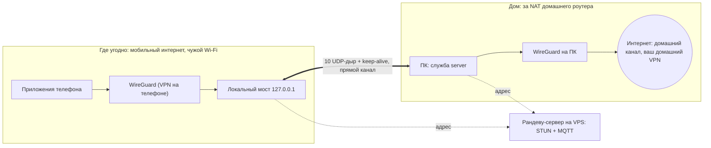
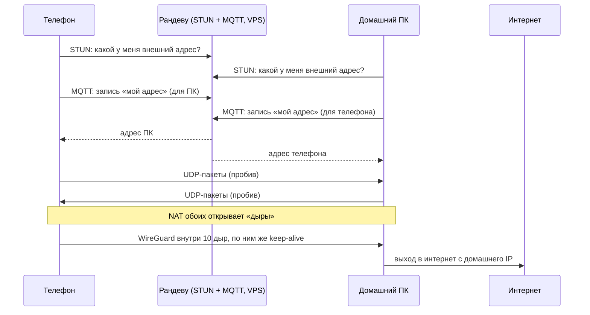

# home-proxy

Выходить в интернет с телефона **так, как будто вы дома**, откуда бы вы ни подключались.
Телефон напрямую пробивается (UDP hole punching) до вашего **домашнего ПК**, а тот
выпускает трафик в интернет через свой домашний канал. Для сайтов вы — это ваш дом.

После того как трафик попал на ваш ПК, он идёт дальше через ваш «любимый» домашний VPN
(если он у вас есть): проект доставляет трафик до дома, а как он выходит из дома — решает
настройка ПК.

**Зачем это сделано.** Проект — ответная мера на попытки правительства РФ брать
дополнительные деньги за международный мобильный трафик: трафик идёт напрямую на
домашний ПК, а дальше — через домашний канал.

Пунктир — только встреча: рандеву-сервер сообщает пирам адреса друг друга, пользовательский
трафик через него не идёт. Толстая линия — сам трафик, напрямую между телефоном и домашним ПК.

Последовательность подключения:

## Как это работает

1. Телефон и домашний ПК заранее знают GUID друг друга (это их «имена»).
2. Оба спрашивают у STUN-сервера свой внешний адрес и через MQTT-брокер оставляют друг
   другу записи «вот мой адрес». Брокер и STUN нужны только для встречи.
3. Дальше оба **одновременно шлют пакеты друг другу**, и NAT обоих открывает «дыры»:
   поэтому на домашнем роутере **не нужен проброс портов** и не нужен белый IP.
   Порты перебираются широким диапазоном не зря: нам без разницы, какой там NAT, — если
   порт не совпал со STUN-адресом, дыра найдётся среди соседних.
4. Дыр открывается 10, по ним постоянно идёт keep-alive. Пакеты уходят в случайную
   дыру, поток не выглядит одним устойчивым соединением.
5. Поверх дыр работает обычный **WireGuard**: он шифрует трафик и выпускает его на ПК
   в интернет. Пробив нужен **только до домашнего ПК**, никакой промежуточный сервер
   трафик не пропускает.

## Что нужно

- **Домашний ПК**: служба `server` и WireGuard. Linux — [`wireguard/`](wireguard/README.md), Windows — [`windows/`](windows/README.md).
- **Рандеву-сервер** на любом VPS: STUN и MQTT по TLS, см. [`docker-compose.yml`](docker-compose.yml), [`cert/`](cert/README.md), [`mosquitto/`](mosquitto/README.md).
- **Телефон**: Android-приложение [`android-vpn/`](android-vpn/README.md) (сначала поднимает дыры, потом включает VPN).

Есть и вариант с роутером OpenWrt посередине (несколько телефонов через один канал к
серверу): [`OpenWRT/`](OpenWRT/README.md), [`router/`](router/README.md).

## Оговорки

- **Экспериментальный проект.** XOR внутри протокола только маскирует служебные пакеты,
  шифрует и аутентифицирует трафик WireGuard. Аудита кода не было.
- **Телефон и ПК не должны быть за одним внешним адресом** (нет hairpin NAT) — телефон
  должен быть в другой сети, например на мобильном интернете.
- Для iPhone клиента нет: [`iPhone/README.md`](iPhone/README.md) объясняет, что для этого нужно.

## Состав

| Каталог | Что |
|---|---|
| `hp-backend/` | Rust-библиотеки: протокол и пробив (`connection`), логи, ядро и JNI для Android; `peer` для живых проверок |
| `server/`, `router/` | исполняемые файлы: служба на домашнем ПК (дыры → WireGuard) и релей для OpenWrt |
| `windows/` | установка службы на Windows (WireGuard, NAT, обход VPN для STUN) |
| `android-vpn/` | приложение для Android (Kotlin) |
| `wireguard/` | ключи, конфиги и служба на домашнем ПК |
| `cert/`, `mosquitto/`, `coturn/` | TLS, MQTT-брокер и STUN для рандеву-сервера |
| `OpenWRT/`, `iPhone/` | сборка под роутеры; заметки про iOS |

Устройство протокола — [`hp-backend/connection/README.md`](hp-backend/connection/README.md) и [`CLAUDE.md`](CLAUDE.md).

## TODO

- Обход VPN для STUN на Linux: определять, идёт ли трафик домашнего ПК через VPN, и
  добавлять правило, чтобы STUN шёл напрямую. На Windows это уже есть
  ([`windows/stun-bypass.ps1`](windows/README.md)); без обхода STUN увидит адрес VPN, а не
  домашний, и пробив по этому адресу не сойдётся.
- Проверить на Windows путь через `New-NetNat` (на тестовой ВМ его нет, там NAT через ICS) и
  устойчивость дыр на обычном Wi-Fi: на точке доступа iPhone дыры нестабильны.

## Лицензия

[MIT](LICENSE): использовать и изменять можно свободно, нужно сохранять уведомление об
авторе и текст лицензии.
