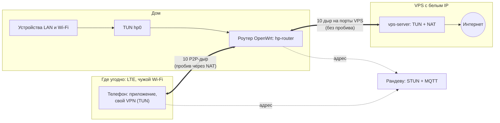
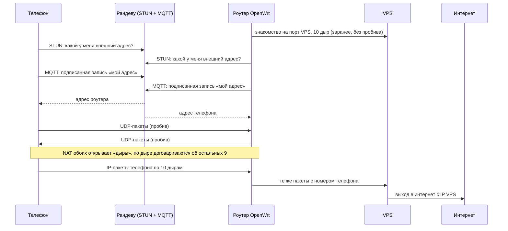
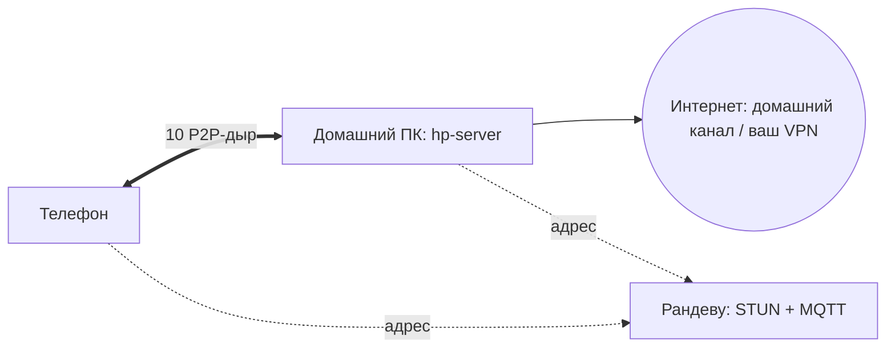

# home-proxy

Выходить в интернет с телефона **через свой дом**, откуда бы вы ни подключались: телефон
напрямую пробивается (UDP hole punching) до домашнего роутера или ПК, а дальше трафик идёт
тем путём, который вы выбрали дома — через свой VPS или через свой домашний VPN.

**Зачем это сделано.** Проект — ответная мера на попытки правительства РФ брать
дополнительные деньги за международный мобильный трафик: с телефона уходит трафик только до
дома, а за границу — уже из дома.

Проект для разных людей, поэтому схем две:

- **есть роутер на OpenWrt** — роутер держит туннель всего дома до вашего VPS и принимает
  телефоны ([ниже](#схема-с-роутером-openwrt-и-vps));
- **роутера нет** — телефон пробивается до домашнего ПК, а ПК выпускает трафик через свой
  домашний VPN ([ниже](#схема-с-домашним-пк)).

WireGuard не используется: трафик внутри и так почти весь HTTPS, повторно его шифровать
незачем. Пакеты по дырам **подписаны** (подделать, вставить, повторить или обрезать пакет
нельзя), заголовки замаскированы — см. [Безопасность](#безопасность).

## Схема с роутером OpenWrt и VPS

Роутер (`hp-router`, один бинарник ~2 МБ) делает две вещи:

1. **Шлюз дома.** Весь трафик LAN и Wi-Fi уходит в интерфейс `hp0` и дальше — по 10 UDP-дырам
   к VPS; на VPS пакеты выходят в интернет через NAT. Для сайтов вы — это ваш VPS.
2. **Пир для телефонов.** Для каждого телефона — свой набор из 10 дыр, пробитых напрямую
   (STUN + MQTT, проброс портов не нужен). Пакеты телефона роутер не разбирает: перекладывает
   их в дыры к VPS с номером телефона (`client_id`), ответы VPS — обратно телефону.

Телефон держит свой VPN без WireGuard: IP-пакеты из системного TUN уходят по дырам как есть.
У телефона свой адрес в туннеле (`10.80.1.<n>`), по нему VPS знает, кому отвечать.

**Порядок пакетов.** Пакеты идут по 10 дырам вперемешку и приходят не по порядку. TCP-пакеты
нумеруются внутри своего соединения, и конечный получатель (VPS или телефон) восстанавливает
порядок; роутер посередине номера не трогает. UDP и ICMP отдаются сразу.

Последовательность подключения телефона:

**Проверено** (2026-09-26): телефон Android на LTE (через точку доступа) → Xiaomi Mi Router 4C
(OpenWrt, MT7628) → VPS → speedtest: **14 Мбит/с на приём, 7 на отдачу**; дыры 10/10 на обоих
участках. Дом через тот же роутер: ~25 Мбит/с в каждую сторону (TCP, iperf) — упирается в
процессор роутера. Замеры и разбор — [`Performance.md`](Performance.md).

Что нужно:

- **VPS** с белым IP: `vps-server` в режиме TUN, NAT подсети туннеля —
  [`vps-server/`](vps-server/README.md), [`OpenWRT/Tun.md`](OpenWRT/Tun.md).
- **Роутер OpenWrt**: `hp-router` (сборка — [`OpenWRT/`](OpenWRT/README.md)), `kmod-tun`,
  маршрут по умолчанию в `hp0` только для LAN (сам роутер — STUN, MQTT, дыры телефонов —
  ходит напрямую через WAN), flow offloading с `hp0` — [`OpenWRT/Tun.md`](OpenWRT/Tun.md).
- **Рандеву-сервер**: STUN и MQTT по TLS на любом VPS (можно на том же) —
  [`docker-compose.yml`](docker-compose.yml), [`cert/`](cert/README.md), [`mosquitto/`](mosquitto/README.md).
- **Телефон**: Android-приложение [`android-vpn/`](android-vpn/README.md) — сначала поднимает дыры,
  потом включает VPN. В приложении: GUID телефона, GUID роутера, адрес в туннеле `10.80.1.<n>`
  (`n` — номер телефона в настройках роутера `PHONE_<n>_*`).

## Схема с домашним ПК

Если роутера на OpenWrt нет: телефон пробивается до **домашнего ПК** (служба `hp-server`), а ПК
выпускает трафик в интернет через свой домашний канал — дальше через ваш «любимый» домашний VPN,
если он есть. Проект доставляет трафик до дома, а как он выходит из дома, решает настройка ПК.
На Windows служба работает в WSL2 ([`wsl/`](wsl/README.md)).

`hp-server` — тот же TUN-сервер, что и на VPS: пакеты телефона пишутся в интерфейс `hp0`, в
интернет выходят через NAT на ПК. Настройка — [`hp-server/`](hp-server/README.md), на Windows —
[`wsl/`](wsl/README.md) и обход VPN для STUN [`windows/`](windows/README.md). **Состояние:** код
общий с проверенной схемой через VPS, но телефон → ПК с TUN вживую ещё не проверялся (раньше
эта схема работала на WireGuard).

## Как работают дыры

1. Оба конца заранее знают **полный GUID** друг друга (например, по QR-коду). Наружу — в MQTT и
   в пакеты — уходит только **имя**: первая группа GUID (`1a2b3c4d`). Из двух полных GUID обе
   стороны получают общий секрет, из него — все ключи.
2. Оба спрашивают у STUN-сервера свой внешний адрес и через MQTT-брокер оставляют друг другу
   подписанные записи «вот мой адрес». Брокер и STUN нужны только для встречи, трафик через
   них не идёт.
3. Дальше оба **одновременно шлют пакеты друг другу**, и NAT обоих открывает «дыры»: на
   домашнем роутере **не нужен проброс портов** и белый IP. Порты перебираются широким
   диапазоном: если NAT выдал не тот порт, что видел STUN, дыра найдётся среди соседних.
4. Первая дыра договаривается об остальных девяти прямо по себе, без брокера. По всем идёт
   keep-alive со случайным периодом; данные уходят в случайную дыру, поток не выглядит одним
   устойчивым соединением. Плохая дыра пробивается заново (у VPS — на другом порту).

## Безопасность

- **Подпись.** В начале каждого пакета — метка ChaCha20-Poly1305 и счётчик: подписаны первые
  128 байт (служебный заголовок и заголовки вложенного IP-пакета) и длина. Без полных GUID пары
  пакет не подделать, не вставить, не обрезать и не повторить; пакет без верной подписи
  отбрасывается и адрес пира не меняет. Байты дальше 128-го не подписаны (на роутере подпись
  всего пакета стоила бы втрое дороже): испортить их может только тот, кто на пути, и HTTPS это
  заметит.
- **Шифрования нет** намеренно: содержимое — и так HTTPS. XOR только маскирует подпись и
  заголовки, чтобы на проводе не было узнаваемого формата.
- **Полные GUID — секрет.** На брокере лежат только имена и адреса слотов, подписанные;
  ключей и GUID там нет.
- **Экспериментальный проект**, аудита кода не было.

## Оговорки

- **Телефон и дом не должны быть за одним внешним адресом** (нет hairpin NAT): телефон должен
  быть в другой сети, например на мобильном интернете.
- Роутеру нужен процессор: на MT7628 (одно ядро 580 МГц) потолок ~25–30 Мбит/с для дома.
- Для iPhone клиента нет: [`iPhone/README.md`](iPhone/README.md) объясняет, что для этого нужно.

## Состав

| Каталог | Что |
|---|---|
| `hp-backend/` | Rust-библиотеки: протокол, подпись и пробив (`connection`), TUN (`tun`), ядро и JNI для Android (`client`, `android-lib`), логи; `peer` для живых проверок |
| `hp-router/` | роутер OpenWrt: шлюз дома к VPS + пир для телефонов |
| `vps-server/`, `vps-client/` | VPS с белым IP: без STUN, MQTT и пробива (клиент — роутер или хост) |
| `hp-server/` | служба на домашнем ПК (схема без роутера) |
| `android-vpn/` | приложение для Android (Kotlin): свой VPN на TUN |
| `OpenWRT/` | сборка под роутеры, настройка TUN и ускорение (`Tun.md`) |
| `control/` | (описание) пульт управления: трей на Slint, сопряжение по QR с Android |
| `wsl/`, `windows/` | домашний ПК на Windows: образ Alpine для WSL2, обход VPN для STUN |
| `cert/`, `mosquitto/`, `coturn/` | TLS, MQTT-брокер и STUN для рандеву-сервера |
| `iPhone/` | заметки про iOS |

Замеры скорости и восстановление порядка пакетов — [`Performance.md`](Performance.md).

Устройство протокола — [`hp-backend/connection/README.md`](hp-backend/connection/README.md) и [`CLAUDE.md`](CLAUDE.md).

## TODO

- Проверить вживую схему телефон → ПК (`hp-server` на TUN, в том числе в WSL2).
- `hp-router`: служба procd (сейчас запуск руками из `/tmp`).
- Обход VPN для STUN на Linux: определять, идёт ли трафик домашнего ПК через VPN, и
  добавлять правило, чтобы STUN шёл напрямую. На Windows это уже есть
  ([`windows/stun-bypass.ps1`](windows/README.md)); без обхода STUN увидит адрес VPN, а не
  домашний, и пробив по этому адресу не сойдётся.

## Лицензия

[MIT](LICENSE): использовать и изменять можно свободно, нужно сохранять уведомление об
авторе и текст лицензии.
