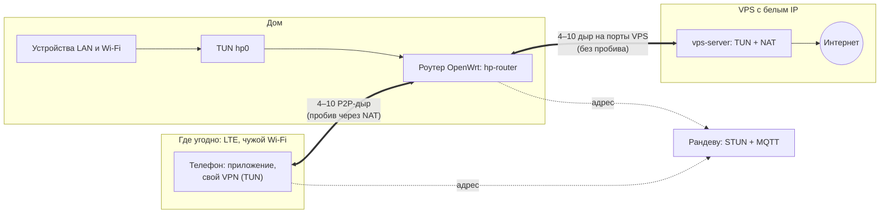
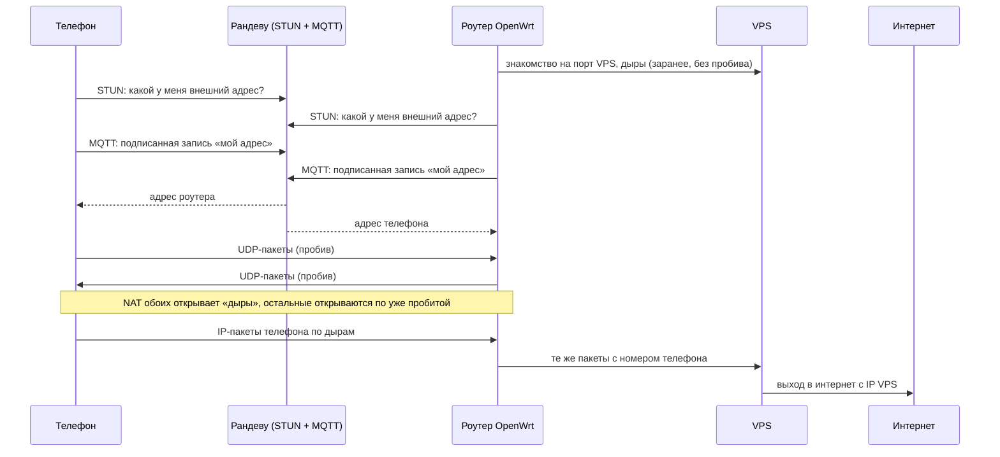
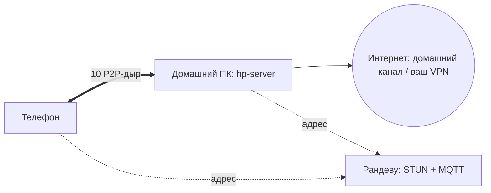

# home-proxy

Выходить в интернет с телефона **через свой дом**, откуда бы вы ни подключались: телефон
напрямую пробивается (UDP hole punching) до домашнего роутера или ПК, а дальше трафик идёт
тем путём, который вы выбрали дома — через свой VPS или через свой домашний VPN.

**Зачем это сделано.** Проект — ответная мера на попытки правительства РФ брать
дополнительные деньги за международный мобильный трафик: с телефона уходит трафик только до
дома, а за границу — уже из дома.

Проект для разных людей, поэтому схем две:

- **есть роутер на OpenWrt** — роутер держит туннель всего дома до вашего VPS и принимает
  телефоны ([ниже](#схема-с-роутером-openwrt-и-vps));
- **роутера нет** — телефон пробивается до домашнего ПК, а ПК выпускает трафик через свой
  домашний VPN ([ниже](#схема-с-домашним-пк)).

WireGuard не используется: трафик внутри и так почти весь HTTPS, повторно его шифровать
незачем. Пакеты по дырам **подписаны** (подделать, вставить, повторить или обрезать пакет
нельзя), заголовки замаскированы — см. [Безопасность](#безопасность).

## Схема с роутером OpenWrt и VPS

```mermaid
flowchart LR
    subgraph away["Где угодно: LTE, чужой Wi-Fi"]
        phone["Телефон: приложение,<br/>свой VPN (TUN)"]
    end
    subgraph home["Дом"]
        lan["Устройства LAN и Wi-Fi"] --> tun["TUN hp0"]
        router["Роутер OpenWrt: hp-router"]
        tun --> router
    end
    subgraph vps["VPS с белым IP"]
        vs["vps-server: TUN + NAT"] --> net(("Интернет"))
    end
    phone <==>|"4–10 P2P-дыр<br/>(пробив через NAT)"| router
    router <==>|"4–10 дыр на порты VPS<br/>(без пробива)"| vs
    rdv["Рандеву: STUN + MQTT"]
    phone -.->|"адрес"| rdv
    router -.->|"адрес"| rdv
```

Роутер (`hp-router`, один бинарник ~2 МБ) делает две вещи:

1. **Шлюз дома.** Весь трафик LAN и Wi-Fi уходит в интерфейс `hp0` и дальше — по UDP-дырам
   к VPS; на VPS пакеты выходят в интернет через NAT. Для сайтов вы — это ваш VPS.
2. **Пир для телефонов.** Для каждого телефона — свой набор дыр, пробитых напрямую
   (STUN + MQTT, проброс портов не нужен). Пакеты телефона роутер не разбирает и в `hp0` не
   пускает: перекладывает их в дыры к VPS с номером телефона (`client_id`), ответы VPS — обратно
   телефону.

**Набор дыр динамический.** Не фиксированные 10 дыр, а от 4 до 10 «в работе»: каждая дыра живёт
случайные 3–10 минут, потом сливается по договорённости с пиром (просьба, подтверждение, ещё
~2 с приёма без отправки) и заменяется новой на другом порту — трафик при этом не прерывается.
Дыра с потерями выше порога уходит раньше. Так на проводе нет устойчивой пары портов, по которой
можно накопить статистику.

Телефон держит свой VPN без WireGuard: IP-пакеты из системного TUN уходят по дырам как есть.
Адрес в туннеле и DNS телефону выдаёт VPS (запрос идёт через роутер): роутеры и хосты
получают `10.80.0.x`, телефоны — `10.80.1.x` и дальше, у каждого свой и постоянный.

**Порядок пакетов.** Пакеты идут по всем живым дырам вперемешку и приходят не по порядку. TCP-пакеты
нумеруются внутри своего соединения, и конечный получатель (VPS или телефон) восстанавливает
порядок; роутер посередине номера не трогает. UDP и ICMP отдаются сразу.

Последовательность подключения телефона:

```mermaid
sequenceDiagram
    participant P as Телефон
    participant R as Рандеву (STUN + MQTT)
    participant H as Роутер OpenWrt
    participant V as VPS
    participant I as Интернет
    H->>V: знакомство на порт VPS, дыры (заранее, без пробива)
    P->>R: STUN: какой у меня внешний адрес?
    H->>R: STUN: какой у меня внешний адрес?
    P->>R: MQTT: подписанная запись «мой адрес»
    H->>R: MQTT: подписанная запись «мой адрес»
    R-->>P: адрес роутера
    R-->>H: адрес телефона
    P->>H: UDP-пакеты (пробив)
    H->>P: UDP-пакеты (пробив)
    Note over P,H: NAT обоих открывает «дыры», остальные открываются по уже пробитой
    P->>H: IP-пакеты телефона по дырам
    H->>V: те же пакеты с номером телефона
    V->>I: выход в интернет с IP VPS
```

**Проверено.** 2026-09-26: телефон Android на LTE (через точку доступа) → Xiaomi Mi Router 4C
(OpenWrt, MT7628) → VPS → speedtest: **14 Мбит/с на приём, 7 на отдачу**; дыры 10/10 на обоих
участках. Дом через тот же роутер: ~25 Мбит/с в каждую сторону (TCP, iperf) — упирается в
процессор роутера. 2026-10-10 (динамический набор дыр): тот же телефон на хотспоте iPhone →
домашний роутер OpenWrt `hp-router` (MT7621) → VPS: дыры 9–10/10, TCP 16.8 Мбит/с одним
соединением и 19.7 четырьмя, замена дыр на лету; потери на пингах 0–8% приходились на радиоканал
телефона (метрики дыр — 0%). Замеры и разбор — [`Performance.md`](Performance.md).

Что нужно:

- **VPS** с белым IP: `vps-server` в режиме TUN, NAT подсети туннеля —
  [`vps-server/`](vps-server/README.md), [`OpenWRT/Tun.md`](OpenWRT/Tun.md).
- **Роутер OpenWrt**: `hp-router` (сборка — [`OpenWRT/`](OpenWRT/README.md)), `kmod-tun`,
  маршрут по умолчанию в `hp0` только для LAN (сам роутер — STUN, MQTT, дыры телефонов —
  ходит напрямую через WAN), flow offloading с `hp0` — [`OpenWRT/Tun.md`](OpenWRT/Tun.md).
- **Рандеву-сервер**: STUN и MQTT по TLS на любом VPS (можно на том же) —
  [`docker-compose.yml`](docker-compose.yml), [`cert/`](cert/README.md), [`mosquitto/`](mosquitto/README.md).
- **Телефон**: Android-приложение [`android-vpn/`](android-vpn/README.md) — сначала поднимает дыры,
  потом включает VPN с адресом и DNS от сервера. В приложении: GUID телефона и GUID роутера
  (пара `PHONE_<n>_*` в настройках роутера или пакет сопряжения из трея).
- **Трей на ПК** (по желанию): [`control/`](control/README.md) — состояние роутера, VPS и
  телефонов с потерями по дырам, «Добавить телефон» по QR. Связь с роутером — по строке
  подключения из LuCI (Службы → Home Proxy), канал в LAN зашифрован её ключом.

## Схема с домашним ПК

Если роутера на OpenWrt нет: телефон пробивается до **домашнего ПК** (служба `hp-server`), а ПК
выпускает трафик в интернет через свой домашний канал — дальше через ваш «любимый» домашний VPN,
если он есть. Проект доставляет трафик до дома, а как он выходит из дома, решает настройка ПК.
На Windows служба работает нативно, без WSL и прав администратора ([`windows/`](windows/README.md)).
Если на ПК включён VPN, дыры сами идут мимо него через физический адаптер, а трафик телефона —
через VPN.

```mermaid
flowchart LR
    phone["Телефон"] <==>|"10 P2P-дыр"| pc["Домашний ПК: hp-server"]
    pc --> net(("Интернет: домашний канал / ваш VPN"))
    rdv["Рандеву: STUN + MQTT"]
    phone -.->|"адрес"| rdv
    pc -.->|"адрес"| rdv
```

`hp-server` — тот же сервер, что и на VPS. На Linux пакеты телефона пишутся в интерфейс `hp0`
и выходят через NAT на ПК. На Windows работает свой сетевой стек в процессе: соединения телефона
открываются обычными сокетами ПК. Настройка — [`hp-server/`](hp-server/README.md), на Windows —
[`windows/`](windows/README.md) (запасной вариант — WSL2, [`wsl/`](wsl/README.md)).
**Состояние (2026-10-10):** настоящий телефон (хотспот iPhone) ↔ `hp-server` проверен вживую на
Linux и на Windows (`MODE=netstack`): дыры 10/10, замена дыр на лету, пинг без потерь, TCP
~4 Мбит/с одним соединением (окно 64 КБ в `netstack` при RTT ~130 мс) и 12–15 Мбит/с четырьмя.
Раньше проверялось с клиентом на VPS вместо телефона, в том числе при полном туннеле OpenVPN.
`MODE=tun` с настоящим телефоном пока не проверялся.

## Как работают дыры

1. Оба конца заранее знают **полный GUID** друг друга (например, по QR-коду). Наружу — в MQTT и
   в пакеты — уходит только **имя**: первая группа GUID (`1a2b3c4d`). Из двух полных GUID обе
   стороны получают общий секрет, из него — все ключи.
2. Оба спрашивают у STUN-сервера свой внешний адрес и через MQTT-брокер оставляют друг другу
   подписанные записи «вот мой адрес». Брокер и STUN нужны только для встречи, трафик через
   них не идёт.
3. Дальше оба **одновременно шлют пакеты друг другу**, и NAT обоих открывает «дыры»: на
   домашнем роутере **не нужен проброс портов** и белый IP. Порты перебираются широким
   диапазоном: если NAT выдал не тот порт, что видел STUN, дыра найдётся среди соседних.
4. Пока живых дыр нет, адреса идут через MQTT; как только одна дыра пробита, остальные
   договариваются по ней, без брокера. Ролей нет: кто начал открывать дыру, тот начал, а пир
   в ответ открывает свою, если у него их меньше 10. По всем идёт keep-alive со случайным
   периодом; данные уходят в случайную дыру, поток не выглядит одним устойчивым соединением.
   Дыры живут 3–10 минут и заменяются новыми (у VPS — на другом порту); плохая заменяется сразу.

## Безопасность

- **Подпись.** В начале каждого пакета — метка ChaCha20-Poly1305 и счётчик: подписаны первые
  128 байт (служебный заголовок и заголовки вложенного IP-пакета) и длина. Без полных GUID пары
  пакет не подделать, не вставить, не обрезать и не повторить; пакет без верной подписи
  отбрасывается и адрес пира не меняет. Байты дальше 128-го не подписаны (на роутере подпись
  всего пакета стоила бы втрое дороже): испортить их может только тот, кто на пути, и HTTPS это
  заметит.
- **Шифрования нет** намеренно: содержимое — и так HTTPS. XOR только маскирует подпись и
  заголовки, чтобы на проводе не было узнаваемого формата.
- **Полные GUID — секрет.** На брокере лежат только имена и адреса слотов, подписанные;
  ключей и GUID там нет. В логи и в статус управления попадают только имена (первая группа GUID).
- **Управление** (трей, `hpctl`, LuCI) — только loopback или адрес LAN, канал зашифрован ключом
  строки подключения (ChaCha20-Poly1305, ключ по сети не передаётся). Строка подключения и пакет
  сопряжения (QR) — секреты: у кого строка, тот добавляет и удаляет телефоны; при утечке —
  «Новая строка подключения».
- **Экспериментальный проект**, аудита кода не было.

## Оговорки

- **Телефон и дом не должны быть за одним внешним адресом** (нет hairpin NAT): телефон должен
  быть в другой сети, например на мобильном интернете.
- **Версии P2P несовместимы с прежними** (были фиксированные слоты): телефон, роутер и
  `hp-server` обновляются вместе.
- Роутеру нужен процессор: на MT7628 (одно ядро 580 МГц) потолок ~25–30 Мбит/с для дома.
- Для iPhone клиента нет: [`iPhone/README.md`](iPhone/README.md) объясняет, что для этого нужно.

## Состав

| Каталог | Что |
|---|---|
| `hp-backend/` | Rust-библиотеки: протокол, подпись и пробив (`connection`), TUN (`tun`), ядро и JNI для Android (`client`, `android-lib`), логи; `peer` для живых проверок |
| `hp-router/` | роутер OpenWrt: шлюз дома к VPS + пир для телефонов |
| `vps-server/`, `vps-client/` | VPS с белым IP: без STUN, MQTT и пробива (клиент — роутер или хост) |
| `hp-server/` | служба на домашнем ПК (схема без роутера) |
| `android-vpn/` | приложение для Android (Kotlin): свой VPN на TUN |
| `OpenWRT/` | сборка под роутеры, настройка TUN и ускорение (`Tun.md`) |
| `control/` | управление службой: протокол, трей на Slint (Windows, Linux; несколько служб в одном окне), `hpctl`, сопряжение по QR |
| `setup/` | скрипты установки VPS-схемы (`.sh` для Linux, `.bat` для Windows) |
| `windows/`, `wsl/` | домашний ПК на Windows: нативный `hp-server.exe`; запасной вариант — образ Alpine для WSL2 |
| `cert/`, `mosquitto/`, `coturn/` | TLS, MQTT-брокер и STUN для рандеву-сервера |
| `iPhone/` | заметки про iOS |

Замеры скорости и восстановление порядка пакетов — [`Performance.md`](Performance.md).

Устройство протокола — [`hp-backend/connection/README.md`](hp-backend/connection/README.md) и [`CLAUDE.md`](CLAUDE.md).

## TODO

- Проверить вживую `hp-server` на `MODE=tun` (Linux) с настоящим телефоном.
- Служба Windows для `hp-server.exe` (сейчас — процесс в сеансе пользователя).
- Трей на Windows — проверить окно и значок в интерактивном сеансе.
- `hp-router`: маршруты `hp0` ставит сама служба (`ROUTES=auto`); перезагрузка firewall после
  запуска (flowtable) пока руками — см. [`OpenWRT/Tun.md`](OpenWRT/Tun.md).
- Разобрать, почему у телефона на мобильном канале RTT и потери заметно выше, чем у роутера
  с тем же VPS (см. [`Performance.md`](Performance.md)).

## Лицензия

[MIT](LICENSE): использовать и изменять можно свободно, нужно сохранять уведомление об
авторе и текст лицензии.
